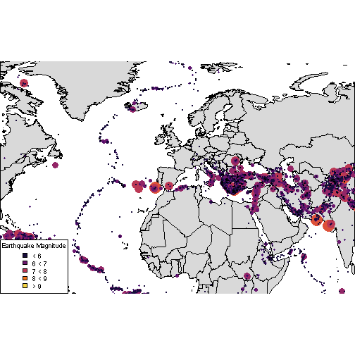

## Data Import
Earthquake data is a combination of two data sources:

  * The Global Historical Earthquake Archive (see [GEM](https://www.globalquakemodel.org/what/seismic-hazard/historical-catalogue/))
  * The International Seismological Centre (see [ISC](http://www.isc.ac.uk/iscgem/))

All the source code for the tool is available on [Github](github.com/suttonbm/datasciencecoursera/tree/master/Developing_Data_Products/Project/DDP_Final_Project).

While the tool was developed to be used through a Shiny UI, all the features are also available as standalone R scripts.  To load the earthquake dataset at the console, run the following:


```r
source(paste0(pathToRepo, 'loadEarthquakeData.R'))
```


Data files will be dynamically loaded from the web if they are not available.  Note that ISC data, although freely available, must be requested at the link above.

--- &twocol

## Plot Generation
Earthquake plots are generated using the `maps` package in combination with R base graphics.  A plot can be generated using the source package as follows:

*** =left



*** =right


```r
source(paste0(pathToRepo, 'generateMap.R'))
generateMap(rawData.M,
            colorMap = "inferno",
            circleScale = 3.5,
            xlim = c(-80, 80),
            ylim = c(0, 80))
```

