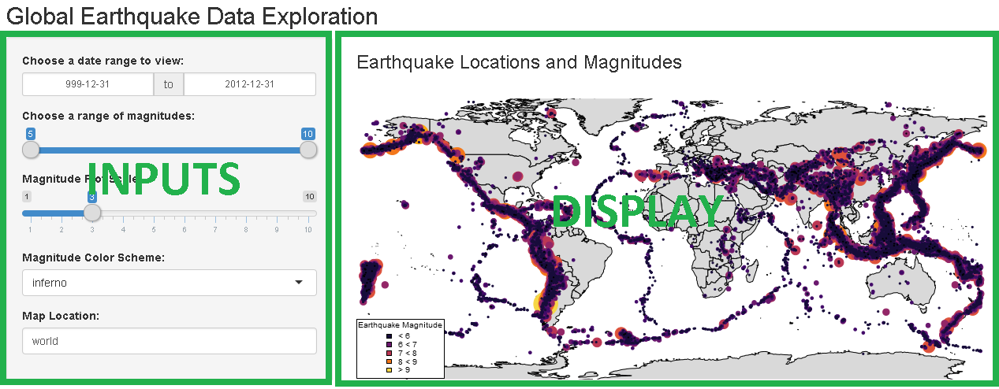

# Documentation

## About the Earthquake Visualization Tool
The earthquake visualization tool was developed for the Developing Data Products course offered by Johns Hopkins University on Coursera.  The purpose of the tool is to allow a user to explore historical earthquake data by magnitude, date, and location.  A map is drawn for a selected region, and earthquakes are overlaid on the map with scale and color corresponding to earthquake magnitude.

Earthquake data is a combination of two data sources:

  * The Global Historical Earthquake Archive (see [GEM](https://www.globalquakemodel.org/what/seismic-hazard/historical-catalogue/))
  * The International Seismological Centre (see [ISC](http://www.isc.ac.uk/iscgem/))

#### GEM Data:
The data provided by GEM is a collection of earthquakes
with magnitude 7 or higher, between the years of 1000
and 1903. These data are based on a compilation of 
academic articles and studies into this historical
record.

#### ISC Data:
The data provided by ISC is a collection of earthquakes
with magnitude 5.5 or higher, between the years of 1900
and 2012.  These data are based on actual geological
observations and seismic data.

## How to use the Earthquake Visualization Tool
The earthquake visualization tool consists of two portions:

  * User inputs (filters)
  * Plot output (display)

These two sections are highlighted in the image below.

The user inputs and their use are described below:

  * Date Range
    * Data provided by ISC and GEM span from 1000 - 2012 AD. The range of geological events to be plotted can be customized with the date range input.
    * To choose a date, select one of the input fields and either:
      * Select a date from the calendar that pops up
      * Type in a date using the format YYYY-MM-DD
  * Magnitude
    * Data spans magnitude ranges from 5.5 - 9.5
      * Note that data units can be magnitude on the Richter scale OR Moment magnitude.  While this is not technically appropriate, seismic measurements do not exist for very old earthquakes, and must be approximated.
      * For more information, refer to: [Richter](https://en.wikipedia.org/wiki/Richter_magnitude_scale) and [Moment](https://en.wikipedia.org/wiki/Moment_magnitude_scale)
    * Use the slider to choose min and max range to be plotted
  * Magnitude Plot Scale
    * The tool will use color and circle size to depict earthquake magnitude on the display. The user can customize the circle scaling.
    * To tweak circle scale, choose a value on the slider.
  * Color Scheme
    * There are four color schemes provided:
      * Viridis
      * Inferno
      * Plasma
      * Magma
    * The color scheme can be tweaked to the user's aesthetic preferences.
    * Refer to [link](https://cran.r-project.org/web/packages/viridis/vignettes/intro-to-viridis.html) for information about the color sets used.
  * Map Location
    * The default map drawn is a world map with a rectilinear (cylindrical) projection.  However, the tool is capable of displaying data for a particular country or region.
    * To select an area to zoom in on, simply type the name into the map location field
      * If a location is not found, the map will default to the world view
