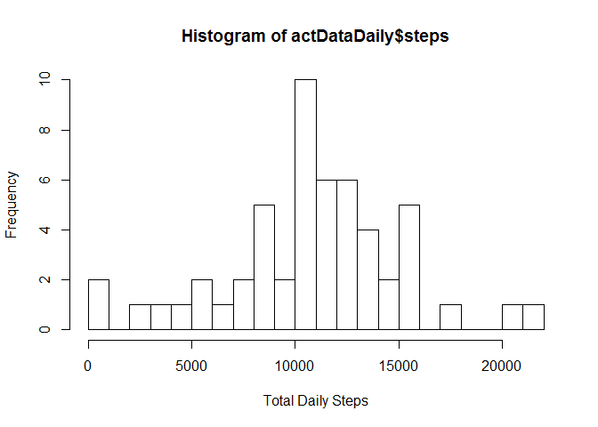
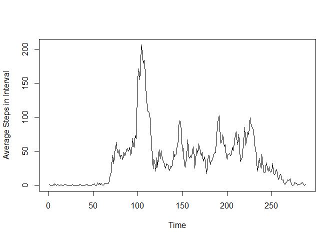

# Reproducible Research: Peer Assessment 1


## Introduction
In this document, I will perform an initial data analysis of an activity monitoring dataset. All code used will be included for the sake of reproducibility.

### Loading and Preprocessing
First we need to download the data from the internet and import into an R session:

```r
download.file("https://d396qusza40orc.cloudfront.net/repdata%2Fdata%2Factivity.zip", "activitydata.zip")
unzip("activitydata.zip")
actData <- read.csv("activity.csv")
actData$date <- as.Date(actData$date, "%Y-%m-%d")
```
The `actData` dataset consists of 17568 rows and 3 columns of data.  The three columns are `steps`, `date`, and `interval`:
 * `steps` -> number of steps taken in a five-minute interval
 * `date` -> the date when a measurement was taken
 * `interval` -> an identifier for the five-minute interval in which a measurement was taken

```r
dim(actData)
```

```
## [1] 17568     3
```

```r
summary(actData)
```

```
##      steps             date               interval     
##  Min.   :  0.00   Min.   :2012-10-01   Min.   :   0.0  
##  1st Qu.:  0.00   1st Qu.:2012-10-16   1st Qu.: 588.8  
##  Median :  0.00   Median :2012-10-31   Median :1177.5  
##  Mean   : 37.38   Mean   :2012-10-31   Mean   :1177.5  
##  3rd Qu.: 12.00   3rd Qu.:2012-11-15   3rd Qu.:1766.2  
##  Max.   :806.00   Max.   :2012-11-30   Max.   :2355.0  
##  NA's   :2304
```
Also note that the data has a large number of "NA" values.  We will address these values later.

### Analysis
Let's look at some properties of the dataset.  We can do some quick initial analysis of daily steps by aggregating the data.  Note that for now, we will ignore NA values:

```r
actData2 <- na.omit(actData)
actDataDaily <- aggregate(actData2$steps, by=list(actData2$date), FUN="sum")
names(actDataDaily) <- c("date", "steps")
```

#### What is Mean Total Steps/Day?
Let's generate a histogram of steps taken per day:

```r
hist(actDataDaily$steps, breaks=20, xlab="Total Daily Steps")
```

<!-- -->
We can also compare to the mean and median:

```r
(meanDailySteps <- mean(actDataDaily$steps))
```

```
## [1] 10766.19
```

```r
(medianDailySteps <- median(actDataDaily$steps))
```

```
## [1] 10765
```
Note that the mean and median make sense when compared to the histogram - both fall near the middle of the distribution (which is ~normal)

#### Average Daily Activity
Let's take a look at 5-minute intervals throughout the day.  Which inverval has the highest average activity?

```r
actDataIntervals <- aggregate(actData2$steps, by=list(actData2$interval), FUN="mean")
names(actDataIntervals) <- c("interval", "steps")
plot.ts(actDataIntervals$steps, ylab="Average Steps in Interval")
```

<!-- -->
The maximum average steps in a five minute interval is:

```r
(maxSteps <- max(actDataIntervals$steps))
```

```
## [1] 206.1698
```
And the interval in which the max occurs is:

```r
(maxStepsInterval <- actDataIntervals$interval[actDataIntervals$steps == maxSteps])
```

```
## [1] 835
```

#### Interpreting Missing Values
There are a couple different ways to interpret missing values.  We could assume that any missing values are actually zero steps, or, we could look at the interval of a missing value and apply the average step count of all the other days:

```r
fixNAs <- function(steps, interval) {
  if (is.na(steps)) {
    return(actDataIntervals$steps[actDataIntervals$interval == interval])
  } else {
    return(steps)
  }
}

actData3 <- actData
actData3$steps <- mapply(fixNAs, actData3$steps, actData3$interval)
```
Let's examine the impact of adding NA values:

```r
actData3Daily <- aggregate(actData3$steps, by=list(actData3$date), FUN="sum")
names(actData3Daily) <- c("date", "steps")
hist(actData3$steps, breaks=20, xlab="Total Daily Steps")
```

<!-- -->

```r
mean(actData3Daily$steps)
```

```
## [1] 10766.19
```

```r
median(actData3Daily$steps)
```

```
## [1] 10766.19
```
There is a slight, but minor, impact to the mean and median values when including estimated NA values based on interval.  The histogram is nearly indistinguishable.

#### Activity Patterns Weekday vs Weekend
Let's take a look at the trends for activity between weekends and weekdays.  First, we need to create a data column reflecting day of the week and categorize:

```r
actData3$wkday <- weekdays(actData3$date, abbreviate=T) %in% c("Sat", "Sun")
actData3$wkdayfactor <- as.factor(actData3$wkday)
levels(actData3$wkdayfactor) <- c("weekday", "weekend")
actData3Intervals <- aggregate(actData3$steps, by=list(actData3$interval, actData3$wkdayfactor), FUN="mean")
names(actData3Intervals) <- c("interval", "wkdayfactor", "steps")
```
Let's create a side-by-side graphic comparison:

```r
library(lattice)
xyplot(steps ~ interval | wkdayfactor, data=actData3Intervals, type="l")
```

<!-- -->
There are some differences between the two, namely higher overall activity on the weekend.
